# Technical interview questions

The list is based on this post: https://hackernoon.com/technical-data-science-interview-questions-sql-and-coding-jv1k32bf

Categories:

* SQL
* Coding
* Algorithmic


## SQL

Suppose we have the following schema with two tables: Ads and Events

* Ads(ad_id, campaign_id, status)
* status cound be active or inactive
* Events(event_id, ad_id, source, event_type, date, hour)
* event_type could be impression, click, conversion

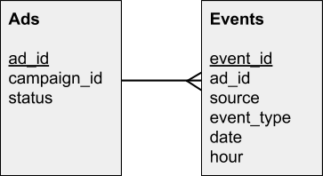


Write SQL queries to extract the following information:

**1)** The number of active ads.

```sql
SELECT count(*) FROM Ads WHERE status = 'active'; 
```

<br/>


**2)** All active campaigns. A campaign is active if there’s at least one active ad.

```sql
SELECT DISTINCT a.campaign_id
FROM Ads AS a
WHERE a.status = 'active'; 
```

<br/>

**3)** The number of active campaigns.

```sql
SELECT COUNT(DISTINCT a.campaign_id)
FROM Ads AS a
WHERE a.status = 'active'; 
```

<br/>

**4)** The number of events per each ad — broken down by event type.

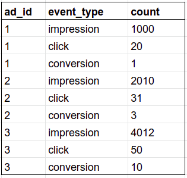

```sql
SELECT a.ad_id, e.event_type, count(*) as "count"
FROM Ads AS a
  JOIN Events AS e
      ON a.ad_id = e.ad_id
GROUP BY a.ad_id, e.event_type
ORDER BY a.ad_id, "count" DESC; 
```

<br/>

**5)** The number of events over the last week per each active ad — broken down by event type and date (most recent first).

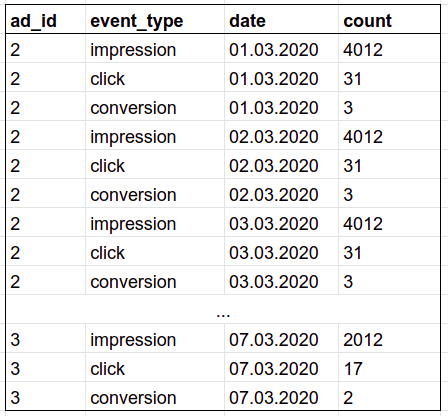

```sql
SELECT a.ad_id, e.event_type, e.date, count(*) as "count"
FROM Ads AS a
  JOIN Events AS e
      ON a.ad_id = e.ad_id
WHERE a.status = 'active'
GROUP BY a.ad_id, e.event_type, e.date
ORDER BY e.date ASC, "count" DESC; 
```

<br/>

**6)** The number of events per campaign — by event type.

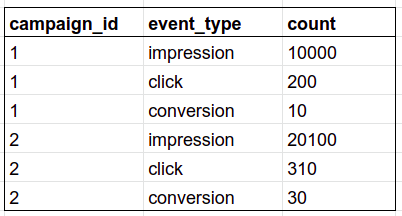


```sql
SELECT a.campaign_id, e.event_type, count(*)
FROM Ads AS a
  INNER JOIN Events AS e
    ON a.ad_id = e.ad_id
GROUP BY a.campaign_id, e.event_type
ORDER BY a.campaign_id;
```

<br/>

**7)** The number of events over the last week per each campaign — broken down by date (most recent first).

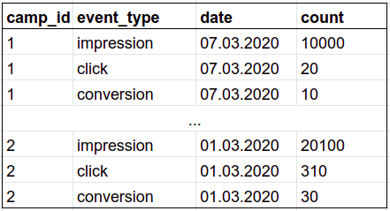

```sql
-- for Postgres

SELECT a.campaign_id, e.event_type, e.date, count(*)
FROM Ads AS a
  INNER JOIN Events AS e
    ON a.ad_id = e.ad_id
WHERE (current_date > e.date)
  AND (current_date - e.date <= 7)
GROUP BY a.campaign_id, e.event_type, e.date
ORDER BY e.date DESC;
```

<br/>

**8)** CTR (click-through rate) for each ad. CTR = number of impressions / number of clicks.

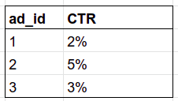

```sql
-- for Postgres

SELECT impressions_clicks_table.campaign_id,
       (impressions_clicks_table.impressions * 100 / impressions_clicks_table.clicks)::FLOAT || '%' AS CTR
FROM
  (
  SELECT a.campaign_id, 
         SUM(CASE e.event_type WHEN 'impression' THEN 1 ELSE 0 END) impressions,
         SUM(CASE e.event_type WHEN 'click' THEN 1 ELSE 0 END) clicks
  FROM Ads AS a
    INNER JOIN Events AS e
      ON a.ad_id = e.ad_id
  GROUP BY a.campaign_id
  ) AS impressions_clicks_table
ORDER BY impressions_clicks_table.campaign_id;
```

<br/>

**9)** CVR (conversion rate) for each ad. CVR = number of clicks / number of installs.

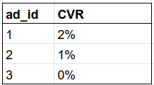

```sql
-- for Postgres

SELECT conversions_clicks_table.campaign_id,
       (conversions_clicks_table.conversions * 100 / conversions_clicks_table.clicks)::FLOAT || '%' AS CVR
FROM
  (
  SELECT a.campaign_id, 
         SUM(CASE e.event_type WHEN 'conversion' THEN 1 ELSE 0 END) conversions,
         SUM(CASE e.event_type WHEN 'click' THEN 1 ELSE 0 END) clicks
  FROM Ads AS a
    INNER JOIN Events AS e
      ON a.ad_id = e.ad_id
  GROUP BY a.campaign_id
  ) AS conversions_clicks_table
ORDER BY conversions_clicks_table.campaign_id;
```

<br/>

**10)** CTR and CVR for each ad broken down by day and hour (most recent first).

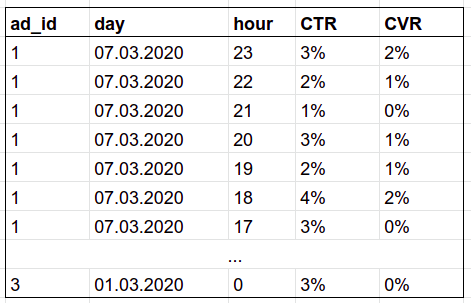

Answer here

<br/>

**11)** CTR for each ad broken down by source and day

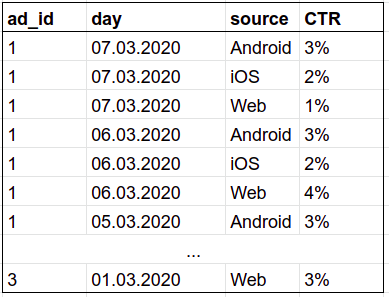

Answer here

<br/>


## Coding (Python)

**1) FizzBuzz.** Print numbers from 1 to 100

* If it’s a multiplier of 3, print “Fizz”
* If it’s a multiplier of 5, print “Buzz”
* If both 3 and 5 — “Fizz Buzz"
* Otherwise, print the number itself 

Example of output: 1, 2, Fizz, 4, Buzz, Fizz, 7, 8, Fizz, Buzz, 11, Fizz, 13, 14, Fizz Buzz, 16, 17, Fizz, 19, Buzz, Fizz, 22, 23, Fizz, Buzz, 26, Fizz, 28, 29, Fizz Buzz, 31, 32, Fizz, 34, Buzz, Fizz, ...

```python
for i in range(1, 101):
    if i % 3 == 0 and i % 5 == 0:
        print('Fizz Buzz')
    elif i % 3 == 0:
        print('Fizz')
    elif i % 5 == 0:
        print('Buzz')
    else:
        print(i)
```

<br/>

**2) Factorial**. Calculate a factorial of a number

* `factorial(5)` = 5! = 1 * 2 * 3 * 4 * 5 = 120
* `factorial(10)` = 10! = 1 * 2 * 3 * 4 * 5 * 6 * 7 * 8 * 9 * 10 = 3628800

```python
def factorial(n):
    result = 1
    for i in range(2, n + 1):
        result *= i
    return result
```

We can also write this function using recursion:

```python
def factorial(n: int):
    if n == 0 or n == 1:
        return 1
    else:
        return n * factorial(n - 1)
```


<br/>

**3) Mean**. Compute the mean of number in a list

* `mean([4, 36, 45, 50, 75]) = 42`
* `mean([]) = NaN` (use `float('NaN')`)

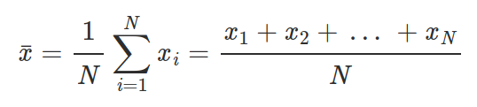

```python
def mean(numbers):
    if len(numbers) > 0:
        return sum(numbers) / len(numbers)
    return float('NaN')
```

<br/>

**4) STD**. Calculate the standard deviation of elements in a list. 

* `std([1, 2, 3, 4]) = 1.29`
* `std([1]) = NaN`
* `std([]) = NaN`

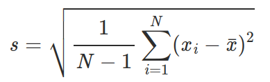

```python
from math import sqrt

def std_dev(numbers):
    if len(numbers) > 0:
        avg = mean(numbers)
        var = sum([(i - avg) ** 2 for i in numbers]) / len(numbers)
        ans = sqrt(var)
        return ans
    return float('NaN')
```

<br/>

**5) RMSE**. Calculate the RMSE (root mean squared error) of a model. The function takes in two lists: one with actual values, one with predictions.

* `rmse([1, 2], [1, 2]) = 0`
* `rmse([1, 2, 3], [3, 2, 1]) = 1.63`

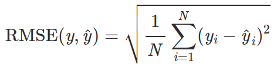

```python
import math

def rmse(y_true, y_pred):
    assert len(y_true) == len(y_pred), 'different sizes of the arguments'
    squares = sum((x - y)**2 for x, y in zip(y_true, y_pred))
    return math.sqrt(squares / len(y_true))
```

<br/>

**6) Remove duplicates**. Remove duplicates in list. The list is not sorted and the order of elements from the original list should be preserved.

* `[1, 2, 3, 1]` ⇒ `[1, 2, 3]`
* `[1, 3, 2, 1, 5, 3, 5, 1, 4]` ⇒ `[1, 3, 2, 5, 4]`

```python
def remove_duplicates(lst):
    new_list = []
    mentioned_values = set()
    for elem in lst:
        if elem not in mentioned_values:
            new_list.append(elem)
            mentioned_values.add(elem)
    return new_list
```

<br/>

**7) Count**. Count how many times each element in a list occurs.

`[1, 3, 2, 1, 5, 3, 5, 1, 4]` ⇒  
* 1: 3 times
* 2: 1 time
* 3: 2 times
* 4: 1 time
* 5: 2 times

```python
numbers = [1, 3, 2, 1, 5, 3, 5, 1, 4]
counter = dict()
for elem in numbers:
    counter[elem] = counter.get(elem, 0) + 1
```
or
```python
from collections import Counter

numbers = [1, 3, 2, 1, 5, 3, 5, 1, 4]
counter = Counter(numbers)
```

<br/>

**8) Palindrome**. Is string a palindrome? A palindrome is a word which reads the same backward as forwards.

* “ololo” ⇒ Yes
* “cafe” ⇒ No

```python
def is_palindrome(s):
    return s == s[::-1]
```
or
```python
def is_palindrome(s):
    for i in range(len(s) // 2):
        if s[i] != s[-i - 1]:
            return False
    return True
```

<br/>

**9) Counter**. We have a list with identifiers of form “id-SITE”. Calculate how many ids we have per site.

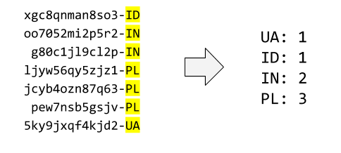

```python
def counter(lst):
    ans = {}
    for i in lst:
        site = i[-2:]
        ans[site] = ans.get(site, 0) + 1
    return ans
```

<br/>

**10) Top counter**. We have a list with identifiers of form “id-SITE”. Show the top 3 sites. You can break ties in any way you want.

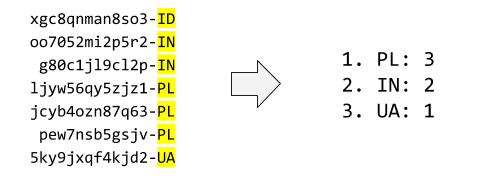

```python
def top_counter(lst):
    site_dict = counter(lst)  # using last problem's solution
    ans = sorted(site_dict, key=site_dict.get)[:3]
    return ans
```

<br/>

**11) RLE**. Implement RLE (run-length encoding): encode each character by the number of times it appears consecutively.

* `'aaaabbbcca'` ⇒ `[('a', 4), ('b', 3), ('c', 2), ('a', 1)]`
* (note that there are two groups of 'a')

```python
def rle(s):
    ans, cur, num = [], None, 0
    for i in range(len(s)):
        if i == 0:
            cur, num = s[i], 1
        elif cur != s[i]:
            ans.append((cur, num))
            cur, num = s[i], 1
        else:
            num += 1
        if i == len(s) - 1:
            ans.append((cur, num))
    return ans
```

<br/>

**12) Jaccard**. Calculate the Jaccard similarity between two sets: the size of intersection divided by the size of union.

* `jaccard({'a', 'b', 'c'}, {'a', 'd'}) = 1 / 4`

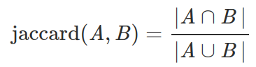

```python
def jaccard(a, b):
    return len(a & b) / len(a | b)
```

<br/>

**13) IDF**. Given a collection of already tokenized texts, calculate the IDF (inverse document frequency) of each token.

* input example: `[['interview', 'questions'], ['interview', 'answers']]`

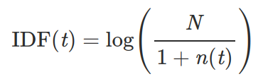

Where:

* t is the token,
* n(t) is the number of documents that t occurs in,
* N is the total number of documents

```python
from math import log10

def idf(lst):
    n_tokens = {}
    for doc in lst:
        for token in doc:
            n_tokens[token] = n_tokens.get(token, 0) + 1
    ans = {}
    for token in n_tokens:
        ans[token] = log10(len(lst) / (1 + n_tokens[token]))
    return ans
```

<br/>

**14) PMI**. Given a collection of already tokenized texts, find the PMI (pointwise mutual information) of each pair of tokens. Return top 10 pairs according to PMI.

* input example: `[['interview', 'questions'], ['interview', 'answers']]`

PMI is used for finding collocations in text — things like “New York” or “Puerto Rico”. For two consecutive words, the PMI between them is:

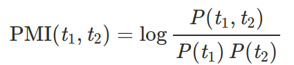

The higher the PMI, the more likely these two tokens form a collection. We can estimate PMI by counting: 


Where:
* N is the total number of tokens in the text,
* c(t1, t2) is the number of times t1 and t2 appear together,
* c(t1) and c(t2) — the number of times they appear separately.


Answer here

<br/>

## Algorithmic Questions

**1) Two sum**. Given an array and a number N, return True if there are numbers A, B in the array such that A + B = N. Otherwise, return False.

* `[1, 2, 3, 4], 5` ⇒ `True`
* `[3, 4, 6], 6` ⇒ `False`

Brute force, O(n<sup>2</sup>):

```python
def two_sum(numbers, target):
    n = len(numbers)

    for i in range(n):
        for j in range(i + 1, n):
            if numbers[i] + numbers[j] == target:
                return True

    return False
```

Linear, O(n):

```python
def two_sum(numbers, target):
    index = {num: i for (i, num) in enumerate(numbers)}

    n = len(numbers)

    for i in range(n):
        a = numbers[i]
        b = target - a

        if b in index:
            j = index[b]
            if i != j:
                return True

    return False
```


<br/>

**2) Fibonacci**. Return the n-th Fibonacci number, which is computed using this formula:

* F(0) = 0
* F(1) = 1
* F(n) = F(n-1) + F(n-2)
* The sequence is: 0, 1, 1, 2, 3, 5, 8, 13, 21, 34, 55, 89, ...

```python
def fibonacci1(n):
    '''naive, complexity = O(2 ** n)'''
    if n == 0 or n == 1:
        return n
    else:
        return fibonacci1(n - 1) + fibonacci1(n - 2)
```

```python
def fibonacci2(n):
    '''dynamic programming, complexity = O(n)'''
    base1, base2 = 0, 1
    for i in range(n):
        base1, base2 = base2, base1 + base2
    return base1
```

```python
def fibonacci3(n):
    '''matrix multiplication, complexity = O(log(n))'''
    def mx_mul(m1, m2):
        ans = [[0 for i in range(len(m2[0]))] for j in range(len(m1))]
        for i in range(len(m1)):
            for j in range(len(m2[0])):
                for k in range(len(m2)):
                    ans[i][j] += m1[i][k] * m2[k][j]
        return ans
    def pow(a, b):
        ans = [[1, 0], [0, 1]]
        while b > 0:
            if b % 2 == 1:
                ans = mx_mul(ans, a)
            a = mx_mul(a, a)
            b //= 2
        return ans
    ans = mx_mul(pow([[1, 1], [1, 0]], n), [[1], [0]])[1][0]
    return ans
```

```python
def fibonacci4(n):
	'''Top down + memorization (dictionary), complexity = O(n)'''
    dic = {1:1, 2:2}
    if n not in dic:
        dic[n] = fibonacci4(n-1) + fibonacci4(n-2)
    return dic[n]
```

```python
def fibonacci5(n):
    '''Top down + memorization (list), complexity = O(n) '''
     if n == 1:
        return 1
    dic = [-1 for i in range(n)]
    dic[0], dic[1] = 1, 2
    def helper(n, dic):
        if dic[n] < 0:
            dic[n] = helper(n-1, dic) + helper(n-2, dic)
        return dic[n]
    return helper(n-1, dic)
```

<br/>

**3) Most frequent outcome**. We have two dice of different sizes (D1 and D2). We roll them and sum their face values. What are the most probable outcomes?

* 6, 6 ⇒ [7]
* 2, 4 ⇒ [3, 4, 5] 

```python
def most_frequent_outcome(d1, d2):
    len_ans = abs(d1 - d2) + 1
    mi = min(d1, d2)
    ans = [mi + i for i in range(1, len_ans + 1)]
    return ans
```

<br/>

**4) Reverse a linked list**. Write a function for reversing a linked list.

* The definition of a list node: `Node(value, next)`
* Example: `a -> b -> c` ⇒ `c -> b -> a`

```python
def reverse_ll(head):
    if head.next is not None:
        last = None
        point = head
        while point is not None:
            point.next, point, last = last, point.next, point
```

<br/>

**5) Flip a binary tree**. Write a function for rotating a binary tree.

* The definition of a tree node: `Node(value, left, right)`

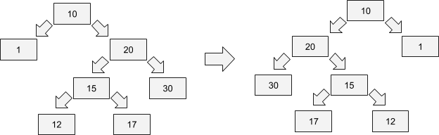

```python
def flip_bt(head):
    if head is not None:
        head.left, head.right = head.right, head.left
        flip_bt(head.left)
        flip_bt(head.right)
```

<br/>

**6) Binary search**. Return the index of a given number in a sorted array or -1 if it’s not there.

* `[1, 4, 6, 10], 4` ⇒ `1`
* `[1, 4, 6, 10], 3` ⇒ `-1`

```python
def binary_search(lst, num):
    left, right = -1, len(lst)
    while right - left > 1:
        mid = (left + right) // 2
        if lst[mid] >= num:
            right = mid
        else:
            left = mid
    if right < 0 or right >= len(lst) or lst[right] != num:
        return -1
    else:
        return right
```

<br/>

**7) Deduplication**. Remove duplicates from a sorted array.

* `[1, 1, 1, 2, 3, 4, 4, 4, 5, 6, 6]` ⇒ `[1, 2, 3, 4, 5, 6]`

```python
def deduplication1(lst):
    '''manual'''
    ans = []
    last = None
    for i in lst:
        if last != i:
            ans.append(i)
            last = i
    return ans

def deduplication2(lst):
    return list(set(lst))
```

<br/>

**8) Intersection**. Return the intersection of two sorted arrays.

* `[1, 2, 4, 6, 10], [2, 4, 5, 7, 10]` ⇒ `[2, 4, 10]`

```python
def intersection1(lst1, lst2):
    '''reserves duplicates'''
    ans = []
    p1, p2 = 0, 0
    while p1 < len(lst1) and p2 < len(lst2):
        if lst1[p1] == lst2[p2]:
            ans.append(lst1[p1])
            p1, p2 = p1 + 1, p2 + 1
        elif lst1[p1] < lst2[p2]:
            p1 += 1
        else:
            p2 += 1
    return ans

def intersection2(lst1, lst2):
    '''removes duplicates'''
    return list(set(lst1) & set(lst2))
```

<br/>

**9) Union**. Return the union of two sorted arrays.

* `[1, 2, 4, 6, 10], [2, 4, 5, 7, 10]` ⇒ `[1, 2, 4, 5, 6, 7, 10]`

```python
def union1(lst1, lst2):
    '''reserves duplicates'''
    ans = []
    p1, p2 = 0, 0
    while p1 < len(lst1) or p2 < len(lst2):
        if lst1[p1] == lst2[p2]:
            ans.append(lst1[p1])
            p1, p2 = p1 + 1, p2 + 1
        elif lst1[p1] < lst2[p2]:
            ans.append(lst1[p1])
            p1 += 1
        else:
            ans.append(lst2[p2])
            p2 += 1
    return ans

def union2(lst1, lst2):
    '''removes duplicates'''
    return list(set(lst1) | set(lst2))
```

<br/>

**10) Addition**. Implement the addition algorithm from school. Suppose we represent numbers by a list of integers from 0 to 9:

* 12 is `[1, 2]`
* 1000 is `[1, 0, 0, 0]`

Implement the “+” operation for this representation

* `[1, 1] + [1]` ⇒ `[1, 2]`
* `[9, 9] + [2]` ⇒ `[1, 0, 1]`

```python
def addition(lst1, lst2):
    def list_to_int(lst):
        ans, base = 0, 1
        for i in lst[::-1]:
            ans += i * base
            base *= 10
        return ans
    val = list_to_int(lst1) + list_to_int(lst2)
    ans = [int(i) for i in str(val)]
    return ans
```

<br/>

**11) Sort by custom alphabet**. You’re given a list of words and an alphabet (e.g. a permutation of Latin alphabet). You need to use this alphabet to order words in the list.

Example:

* Words: `['home', 'oval', 'cat', 'egg', 'network', 'green']`
* Dictionary: `'bcdfghijklmnpqrstvwxzaeiouy'`

Output:

* `['cat', 'green', 'home', 'network', 'egg', 'oval']`

```python
def sort_by_custom_alphabet(dictionary, words): 
    words = sorted(words, key = lambda word: [dictionary.index(c) for c in word]) 
    return words
```

<br/>

**12) Check if a tree is a binary search tree**. In BST, the element in the root is:

* Greater than or equal to the numbers on the left
* Less than or equal to the number on the right
* The definition of a tree node: `Node(value, left, right)`

```python
def check_is_bst(head, min_val=None, max_val=None):
    """Check whether binary tree is binary search tree

    Aside of the obvious node.left.val <= node.val <= node.right.val have to be 
    fulfilled, we also have to make sure that there is NO SINGLE leaves in the
    left part of node have more value than the current node.
    """
    check_val = True
    check_left = True
    check_right = True
    
    if min_val:
        check_val = check_val and (head.val >= min_val)
        min_new = min(min_val, head.val)
    else:
        min_new = head.val
    
    if max_val:
        check_val = check_val and (head.val <= max_val)
        max_new = max(max_val, head.val)
    else:
        max_new = head.val
    
    if head.left:
        check_left = check_is_bst(head.left, min_val, max_new)
    
    if head.right:
        check_right = check_is_bst(head.right, min_new, max_val)
    
    return check_val and check_left and check_right
```

<br/>
